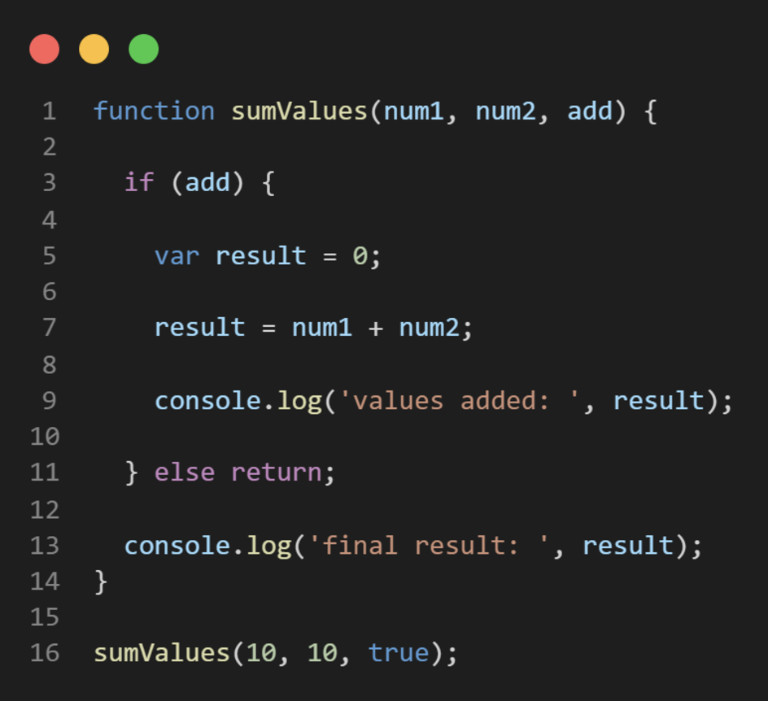
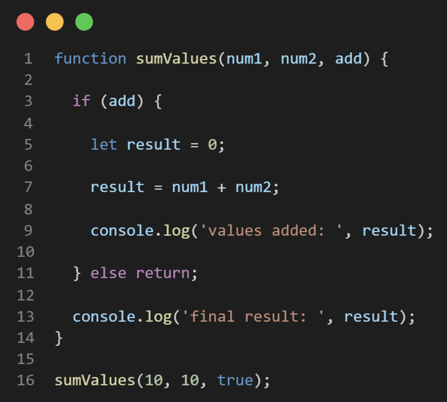

## Part 1: A Quick Introduction...
### var declaration - AVOID USING VAR WHENEVER POSSIBLE

**1. What is printed by line 9? If the code returns an error, explain why.**

The code returns `values added:  20`.

**2. What is printed by line 13? If the code returns an error, explain why.**

The code returns `final result:  20`.

**3. Why should you not use var? Explain why.** 

I should not use var due to its limitations, such as not being able to refer to the variable outside of a function.

**4. What is printed by line 9? If the code returns an error, explain why.**

The code returns `values added:  20`.

**5. What is printed by line 13? If the code returns an error, explain why.**

The code gives an error for this line due to `let` being block-scoped which means that it only exists within the `if` block. Outside the `if` block, `result` does not exist anymore so the compiler does not recognize it anymore.
