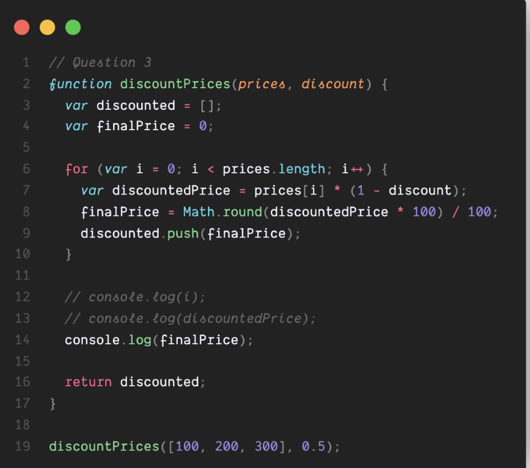

## Part 2. A Little More of a Challenge...
### Question 1


**1. What will happen at line 12 and why? If the code causes an error, explain why.**

It prints `3` because var is function-scoped, so `i` still exists after the for loop finishes. The value of `i` is printed out.

---

### Question 2


**2. What will happen at line 13 and why? If the code causes an error, explain why.**

The code prints out `150`. 

The code does this calculation: `300 * (1 - 0.5) = 150` and this value for `discountedPrice` persists even after the end of the `for` loop. 

---

### Question 3


**3. What will happen at line 14 and why? If the code causes an error, explain why.**

It will print `150`. This is because `finalPrice` is declared using `var`, which is function-scoped, so the variable is still accessible after the loop. Its last value (150) is preserved and printed.

---


### Question 4

**4. What will this function return? Give a brief explanation why. If the code causes an error, explain why.**

The function returns [50, 100, 150] because it applies a 50% discount to each price, rounds each discounted value to 2 decimal places, and adds them to the discounted array, which is returned at the end.

---

### Question 5


**5. What will happen at line 12 and why?  If the code causes an error, explain why. (assume this function is being called like the others: discountPrices([100, 200, 300], 0.5)).**

Line 12 does not execute because `let` is block-scoped. Outside of the `for-loop`, it is not recognized. JavaScript stops executing when it faces an error. Therefore, the later code will not be executed, which means it is not printing the result nor throwing an error. I can see that the error is dependent on the last line that is declared outside of the function which is `discountPrices([100,200,300], 0.5);`. When I add this line, the error seems to throw and without it it seems to run sucessfully but with no print statement and seems to not compile line 12. Function bodies are not executed until the function is invoked, so since the function is not called it will not execute that line and not throw an error.

---

### Question 6


**6. What will happen at line 13 and why? If the code causes an error, explain why.**

It is causing an error due to discountedPrice not being recognized at line 13. This is due to the fact that it is a `let` variable and it is being initialized within the `for-loop` which means that it only exists within the loop and will not be recognized outside of the loop.

---

### Question 7

**7. What will happen at line 14 and why? If the code causes an error, explain why.**

Line 14 printed out `150`. It is a `let` variable and was defined outside of the `for-loop` so it was able to be recognized once it was called after the loop. It was also given a reassigned number within the `for-loop` due to its earlier declaration in the beginning of the function.

---

### Question 8

**8. What will this function return? Give a brief explanation. If the code causes an error, explain why.**

This function will return [50, 100, 150]. It loops through each price, applies a 50% discount, rounds the result, and stores it in the discounted array, which is returned at the end. No error occurs because let is used properly for all variable declarations.

### Question 9


**9. What will happen at line 11 and why? If the code causes an error, explain why.**

This causes an error to print due to `i` being of type `let` which is block-scoped, meaning that it is not accessible outside of the for-loop which would be the block that the variable is contained in.

---

### Question 10


**10. What will happen at line 12 and why? If the code causes an error, explain why.**

Line 12 prints out the value `3`. Since `length` is a `const`, meaning that it cannot be reassigned, and it was declared outside of the `for-loop`, then the line with execute and print out its value. It it had a reassignment of value, then there would be an error thrown due to the nature of a `const` having a constant value at all times.

---

### Question 11


**11. What will this function return? Give a brief explanation. If the code causes an error, explain why.**

The function returns `[50, 100, 150]`  because it applies a 50% discount to each item in the prices array and pushes the result into the discounted array, which is returned at the end. No error occurs because all variables are properly scoped.

## Data Types


1.  Given the above Object, write the notation for: 

    **A. Accessing the value of the `name` property in the student object:**
    ```
    student.name
    ```
    **B.  Accessing the value of the `Grad Year` property in the student object:**
    ```
    student["Grad Year"]
    ```

    **C. Calling the function for the greeting property in the student object:**
    ```
    student.greeting()
    ```

    **D. Accessing the `name` property of the object in the `Favorite Teacher` property in student:**
    ```
    student["Favorite Teacher"].name
    ```
    **E. Accessing index zero in the array of the `courseLoad` property of the student object:**
    ```
    student.courseLoad[0]
    ```

## Basic Operators & Type Conversion 

### 13. Arithmetic

**A. `'3' + 2`**  
Output: `'32'`  
Explanation: `+` with a string triggers **string concatenation**, so 2 is converted to a string.

**B. `'3' - 2`**  
Output: `1`  
Explanation: `-` forces both operands to be **numbers**, so `'3'` becomes 3.

**C. `3 + null`**  
Output: `3`  
Explanation: `null` is 0 in arithmetic, so `3 + 0 = 3`.

**D. `'3' + null`**  
Output: `'3null'`  
Explanation: `+` with a string results in **string concatenation**, so null becomes `'null'`.

**E. `true + 3`**  
Output: `4`  
Explanation: `true` is 1 in arithmetic, so `1 + 3 = 4`.

**F. `false + null`**  
Output: `0`  
Explanation: `false` is 0, `null` is also 0, so the result is `0 + 0 = 0`.

**G. `'3' + undefined`**  
Output: `'3undefined'`  
Explanation: `+` causes string concatenation, so `'3' + 'undefined' = '3undefined'`.

**H. `'3' - undefined`**  
Output: `NaN`  
Explanation: `'3'` is coerced to 3, `undefined` becomes NaN in arithmetic → `3 - NaN = NaN`.

---

### 14. Comparison

**A. `'2' > 1`**  
Output: `true`  
Explanation: `'2'` is converted to 2, and `2 > 1` is true.

**B. `'2' < '12'`**  
Output: `false`  
Explanation: Both are strings, so it compares lexicographically → `'2' > '1'`, so false.

**C. `2 == '2'`**  
Output: `true`  
Explanation: `==` does **type coercion**, so `'2'` becomes 2, and `2 == 2`.

**D. `2 === '2'`**  
Output: `false`  
Explanation: `===` checks **type and value**, so number is not equal to string.

**E. `true == 2`**  
Output: `false`  
Explanation: `true` is 1, so `1 == 2` is false.

**F. `true === Boolean(2)`**  
Output: `true`  
Explanation: `Boolean(2)` is `true`, and both are of type boolean → strict equality.

---

### 15. Difference between `==` and `===`

**`==` (loose equality)** checks for **value equality after type coercion**, so it may convert operands to the same type before comparing.  
**`===` (strict equality)** checks for both **value and type**, so no type conversion happens.

Example:
```
2 == '2'   // true
2 === '2'  // false
```

## Question 16
Given the above Object, write a for...in loop that will iterate through it and print out the value of the property if the property starts with the letter r, or if the value of that property is an odd number.  (This should be in a JS file part2-question16.js)


output of code written ^^


## Question 17


*If the function above is called with the following parameters modifyArray([1,2,3], doSomething), what will be the result? Briefly walk through how you arrived at that result.*


The result is `[2,4,6]`. 

I arrived at that result by going line by line and seeing what references were within the code. The `modifyArray` function, which has the parameters array and the type of callback used, creates an empty array `newArr` and it loops through array `[1,2,3]` and returns each value pushed through the callback function `doSomething` and adds each value into `newArr` and returns that array. `doSomething` just multiplies each value by 2 and `modifyArray` iterates and modifies the existing array using `doSomething`.

## setInterval(), setTimeout(), clearTimeout()

### Question 18
The above program only prints out the time once when executed. Modify this code such that the program prints out the current time every second.  (This should be a JS file - part2-question18.js)

Created JS file that does what is described above

### Question 19

What is the output of the above code?

The output is:

1

4

3

2

This is because `setTimeout` is a delay and for line 2 and 5, the execution is instant. For line 5, it enters the event queue so it prints after lines 2 and 5 and finally line 3 is ecexuted with a delay of 1 second.


